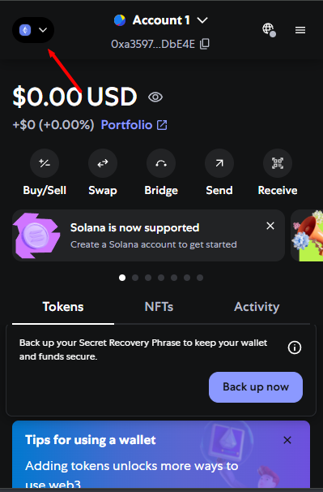
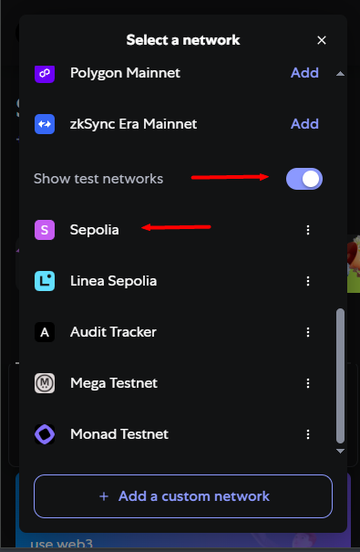
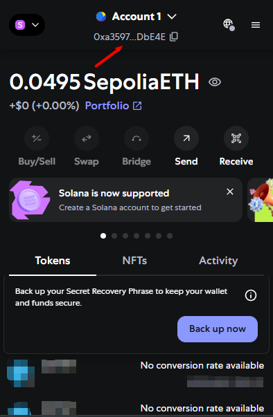
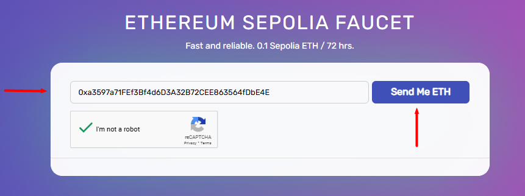
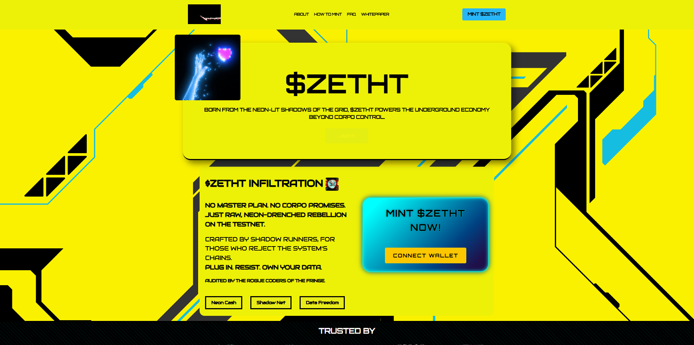
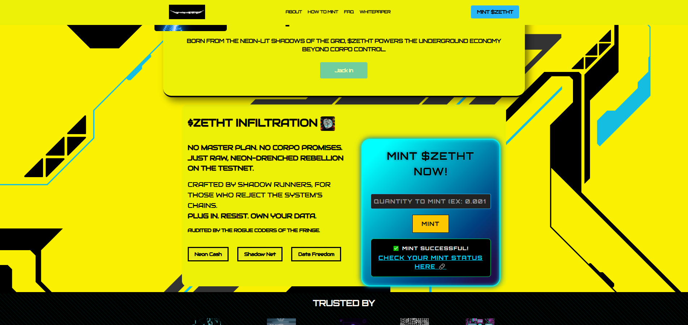
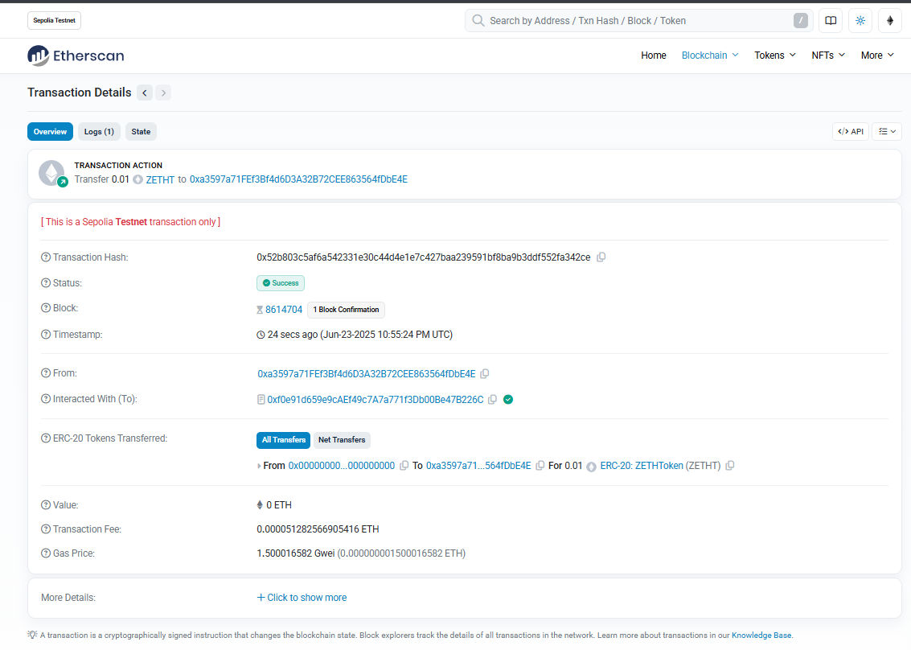

# 🎓 CS50 Final Project – Token Minter on Ethereum Testnet

[](https://reactjs.org/)
[](https://tailwindcss.com/)
[](https://soliditylang.org/)
[](https://hardhat.org/)
[](https://vercel.com/)

> A decentralized application to mint tokens directly to your wallet using MetaMask and an Ethereum testnet.

---

## 🌐 Live Demo

🔗 **[Launch the App](https://harvardx-cs50-2a34.vercel.app/)**

---

## 🧠 Project Summary

This is the final project for **CS50 - Introduction to Computer Science**, by Harvard University. It’s a full-stack dApp that allows users to **mint a token** on a blockchain **test network** through a modern React-based interface, connected to MetaMask and a Solidity smart contract.

💡 A full walkthrough of this project is available on YouTube!  
🎥 [Watch the demo video](https://youtube.com) 

---

## ⚙️ Tech Stack

| Category        | Tools & Libraries                              |
|----------------|--------------------------------------------------|
| **Frontend**    | React.js, Tailwind CSS, DaisyUI, Google Fonts   |
| **Smart Contract** | Solidity (OpenZeppelin contracts)            |
| **Web3 Integration** | ethers.js                                  |
| **Development** | Hardhat + Hardhat Ignition                     |
| **Blockchain**  | Ethereum Testnet (Sepolia / custom)             |
| **Deployment**  | Vercel                                           |

---

## 🚀 Features

- ✅ Connect MetaMask wallet  
- ✅ Add Ethereum testnet (e.g. Sepolia)  
- ✅ Mint token from deployed smart contract  
- ✅ View transaction hash with direct link to SepoliaScan  
- ✅ Fully responsive UI with Tailwind + DaisyUI  

---

## 🧪 How to Run Locally

```bash
git clone https://github.com/analydiadev/harvardx-cs50.git
cd harvardx-cs50
npm install
cd frontend
npm run dev
```

---

## 🔨 Smart Contract Development

```bash
cd backend
npx hardhat compile
npx hardhat test
npx hardhat ignition deploy
```

---

## 🦊 How to Use the App (User Guide)

### 1️⃣ Install MetaMask  
Go to [https://metamask.io](https://metamask.io), install the extension, and create your wallet.

### 2️⃣ Add a Testnet (Sepolia)


```text
Click on the Mainnet, then click on "Show Test Networks" and select Sepolia.
```

### 3️⃣ Get Testnet ETH  
Use a faucet like:  
🔗 **[https://sepoliafaucet.com](https://sepoliafaucet.com)**

``Copy the public address of your wallet, paste it into a faucet and then click "Send Me ETH".``




### 4️⃣ Connect Wallet  
Click “Connect Wallet” and approve via MetaMask.

### 5️⃣ Mint Token  
Click “Mint Token” → Confirm in MetaMask → Done!

### 6️⃣ View Transaction on SepoliaScan  
After minting, a clickable transaction hash will be shown:  
Example:  
🔗 [`0x123...abc`](https://sepolia.etherscan.io/tx/0x123abc) **(the link is dynamically generated after mint)**

### 7️⃣ Add $ZETHT In Your Wallet
MetaMask will open another popup asking if you want to add the token to your wallet, select "Add Token".

---

## 📂 Project Structure

```
backend/contracts/       → Solidity smart contracts  
backend/hardhat/         → Ignition scripts (deployments) 
frontend/src/            → React frontend  
```

---

## 📷 Screenshots 
 


---

## 🧑‍🏫 About the Course

This project was built for **[CS50x](https://cs50.harvard.edu/)** Harvard’s Introduction to Computer Science.

---

## 📄 License

This project is open-source and free for academic and personal use.

---

## 📬 Contact

- Email: anadevofficial@gmail.com
